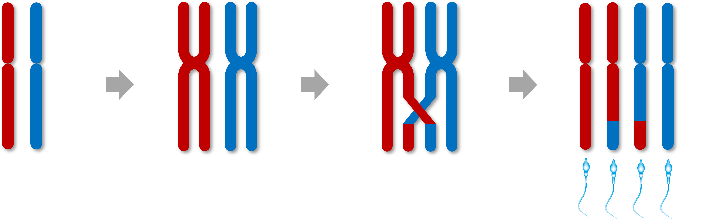

```{r echo = F, results="hide", message=F, warning=F}
library(dplyr)
library(ggplot2)
library(asreml)
library(ggridges)
library(reshape2)

source("r/makeGRM.R")
source("r/ASReml4.EstEffects.R")

recsumm <- read.table("data/20240910_Sparrow_Recomb_Data.txt", header = T)
recsumm$id <- factor(recsumm$id)
recsumm <- na.omit(recsumm)

recmeans <- recsumm %>%
  group_by(id, sex) %>%
  summarise(mean_co_count = mean(co_count),
            mean_intra_shuff = mean(intra_shuff),
            mean_total_coverage = mean(total_coverage),
            var_co_count = var(co_count),
            var_intra_shuff = var(intra_shuff),
            var_total_coverage = var(total_coverage),
            n = n())


pedigree <- read.table("data/20230317_Sparrow_Pedigree.txt", header = T)
ainv <- ainverse(pedigree)

# removing a weird male outlier to make the plots better

recsumm <- subset(recsumm, id != "8N72234")
recmeans <- subset(recmeans, id != "8N72234")


```

### 1. Introduction - recombination in house sparrows.


The positions of meiotic crossover events are measured by tracking the inheritance patterns of alleles between parents and offspring and determining the positions of changes in phase. Our dataset `recsumm` has estimates of crossover count (`co_count`) and intra-chromosomal allelic shuffling (`intra-shuff`) for `r nrow(recsumm)` `offspring` resulting from gametes transmitted from `r length(unique(recsumm$id))` unique `id`.It also includes the `total_coverage` which is the length of the genome informative for identifying crossover events. 

```{r}
head(recsumm)
```

There is also the dataset `recmeans` that summarises this information per individual:

```{r}
head(recmeans)
```


**In this document, I will solely focus on crossover count.**

This is the distribution of crossover counts across all gametes (A) vs an individual's mean crossover count (B). As you can see, there is a clear sex difference in the trait distribution:

```{r echo = F, message=FALSE, fig.width=3, fig.height=4}

ggplot(recsumm, aes(y = sex, x = co_count, fill = sex)) +
  geom_density_ridges(scale = 0.4, alpha = 0.6) +
  geom_boxplot(width = 0.2, outlier.alpha = 0.2, position = position_nudge(y=-0.08), outlier.size = 1) +
  #facet_wrap(~variable, scales = "free") +
  theme_bw() +
  theme(strip.background = element_blank(), strip.text = element_text(size = 14, hjust = 0)) +
  scale_fill_brewer(palette = "Set1") +
  theme(legend.position = "none") +
  labs(y = "Sex", x = "Autosomal Crossover Count") +
  coord_cartesian(xlim = c(0, 40)) +
  ggtitle("A. All gametes")

ggplot(recmeans, aes(y = sex, x = mean_co_count, fill = sex)) +
  geom_density_ridges(scale = 0.4, alpha = 0.6) +
  geom_boxplot(width = 0.2, outlier.alpha = 0.2, position = position_nudge(y=-0.08), outlier.size = 1) +
  #facet_wrap(~variable, scales = "free") +
  theme_bw() +
  theme(strip.background = element_blank(), strip.text = element_text(size = 14, hjust = 0)) +
  scale_fill_brewer(palette = "Set1") +
  theme(legend.position = "none") +
  labs(y = "Sex", x = "Autosomal Crossover Count")  +
  coord_cartesian(xlim = c(0, 40)) +
  ggtitle("B. Individual means")

```

### 2. Crossover count has a high sampling variance, which leads to weird quirks.



Crossover count is an unusual phenotype as there is more intra-individual variation than inter-individual variation. This is because for each crossover event that happens during meiosis, we can assume that is ~50:50 chance that it segregates into the egg or sperm. If you have 40 crossovers, an average of 20 will end up in the gamete. But that still means there is decent variation around that mean. For example, for 1000 gametes coming from an individual with 40 crossovers in every meiosis, the distribution of crossovers in the gametes would be:

```{r echo = F, fig.width=3, fig.height=3}
vec <- NULL
for(i in 1:1000) vec <- c(vec, sum(sample.int(2, 40, replace = T)-1))
hist(vec, breaks = 20)

```

As I stated above, this translates into more intra-individual variation than inter-individual variation. Let's look at the female sparrows with the most unique measures:

```{r echo = F, message=FALSE, fig.height=3.5}

x1 <- subset(recsumm, id %in% subset(recmeans, n > 25 & sex == "F")$id)

ggplot(x1, aes(id, co_count)) +
  geom_boxplot(alpha = 0) +
  geom_jitter(width = 0.2, col = "#E41A1C") +
  #geom_dotplot(binaxis = "y", stackdir = "center", dotsize = 0.4, col = "#E41A1C", fill = "#E41A1C") +
  theme_bw() +
  labs(y = "Autosomal Crossover Count")

```

The variance across individual means is `r var(subset(recmeans, id %in% x1$id)$mean_co_count)`, whereas the variance within individuals is:

```{r echo = F}
x1 %>% group_by(id) %>% summarise(var(co_count))
```

We also observe that individuals with more measures will have means close to the population mean, which has implications for further analysis of fitness!

```{r echo = F, fig.height=3.5, message=F}

ggplot(recmeans, aes(x = mean_co_count, y = n, colour = sex)) +
  geom_point(alpha = 0.1) +
  stat_smooth() +
  scale_color_brewer(palette = "Set1") +
  facet_wrap(~sex, scales = "free_x") +
  theme_bw() +
  theme(legend.position = "none") +
  labs(x = "Individual Mean CO Count", y = "Number for Measures")

```

```{r echo = F, eval = FALSE, fig.height=3.5, message=F}
# Absolute difference
ggplot(recmeans, aes(x = n, y = abs(mean_co_count - mean(recsumm$co_count)), colour = sex)) +
  geom_point(alpha = 0.1) +
  stat_smooth() +
  scale_color_brewer(palette = "Set1") +
  facet_wrap(~sex, scales = "free_x") +
  theme_bw() +
  theme(legend.position = "none") +
  labs(y = "|Ind. mean - pop. mean|", x = "Number for Measures")

# Squared difference
ggplot(recmeans, aes(x = n, y = (mean_co_count - mean(recsumm$co_count))^2, colour = sex)) +
  geom_point(alpha = 0.1) +
  stat_smooth() +
  scale_color_brewer(palette = "Set1") +
  facet_wrap(~sex, scales = "free_x") +
  theme_bw() +
  theme(legend.position = "none") +
  labs(y = "(Ind. mean - pop. mean)^2", x = "Number for Measures")

# Absolute difference, with boxplots
ggplot(recmeans, aes(x = n, y = (mean_co_count - mean(recsumm$co_count))^2, colour = sex)) +
  geom_boxplot(aes(group = n)) +
  stat_smooth() +
  scale_color_brewer(palette = "Set1") +
  facet_wrap(~sex, scales = "free_x") +
  theme_bw() +
  theme(legend.position = "none") +
  labs(y = "|Ind. mean - pop. mean|", x = "Number for Measures")
  
```

In females, once you have more than 3 measures, this effect starts to flatten out. In males it doesn't, perhaps they are more sensitive to this problem because they have fewer crossovers...?

```{r echo = F, fig.height=3.5, message=F}

ggplot(subset(recmeans, n > 2), aes(mean_co_count, n, colour = sex)) +
  geom_point(alpha = 0.1) +
  stat_smooth() +
  scale_color_brewer(palette = "Set1") +
  facet_wrap(~sex, scales = "free_x") +
  theme_bw() +
  theme(legend.position = "none") +
  labs(x = "Individual Mean CO Count", y = "Number for Measures")
  
```


### 2. How heritable is crossover rate?

Because there are differences in distribution between the sexes, let's just focus on **females** for the moment. Heritabilities are estimated using a pedigree-based relationship matrix (this gives very similar results to the GRM used in the McAuley et al 2024 MBE paper). I use `library(asreml)` for the following models.

Below I consider two phenotypes:

1. What is the heritability of the number of crossovers in a sampled gamete?
2. What is the heritability of the mean number of crossovers across all gametes?

Let's begin. Here, the heritability is estimated using the crossovers in all sampled gametes (value for `vm(id, ainv)`):

```{r }

recsumm_f <- subset(recsumm, sex == "F")

female.acc.ped <- asreml(fixed = co_count ~ total_coverage,
                      random = ~ vm(id, ainv) + ide(id),
                      residual = ~idv(units),
                      data = recsumm_f,
                      trace = F)
  
asreml4pin(female.acc.ped)
```

And here is the mean rate per individual (value for `vm(id, ainv)`):

```{r message=FALSE}
recmeans_f <- subset(recmeans, sex == "F")

female.acc.ped.mean <- asreml(fixed = mean_co_count ~ mean_total_coverage + n,
                      random = ~ vm(id, ainv),
                      residual = ~idv(units),
                      data = recmeans_f,
                      trace = F)
  
asreml4pin(female.acc.ped.mean)
```

And here is the mean rate per individual with >2 measures (value for `vm(id, ainv)`):

```{r message=FALSE, echo = F}

female.acc.ped.mean <- asreml(fixed = mean_co_count ~ mean_total_coverage + n,
                      random = ~ vm(id, ainv),
                      residual = ~idv(units),
                      data = subset(recmeans_f, n > 2),
                      trace = F)
  
asreml4pin(female.acc.ped.mean)
```

As you can see, the heritability basically doubles when using the mean measures!

### 3. Genomic prediction for crossover count

Our motivation for using genomic prediction is as follows:


I ran a basic demo model of genomic prediction using the package `hibayes`. I used the `BayesCpi()` function which assumes a small proportion of SNPs (1-Pi) have non-zero effects, and share the same variance, but Pi is not fixed. (*NB. We know from the MBE paper that crossover count is likely to be polygenic so this might not be the best model!*). We ran three prediction models. One for the FULL dataset (i.e. individual gametes), one for the MEAN dataset (i.e. mean values per individual with `n` fit as a fixed effect) and one for the MEAN n>2 dataset (i.e. mean values for individuals that had 3 or more offspring).

Here is an example of the model structure, please see `2_Sparrow_hibayes_run_SEJ.R` for more details.

```{r eval = F}

fitCpi_full <- ibrm(co_count ~ total_coverage,
                    data = recfull,
                    M = geno,
                    M.id = geno.id,
                    method = "BayesCpi",
                    Pi = c(0.98, 0.02), niter = 20000, nburn = 16000, thin = 5,
                    printfreq = 100, seed = 666666, verbose = TRUE)


```

I did some plots of the GEBVs vs. True Phenotypes in the "training" population (NB. the red points on the third plot are the individuals with 2 or fewer measures, so we have phenotypes, they are analagous to a "test" population here)

```{r echo = F, message=F,warning=F, fig.height = 3, fig.width = 3}

# Load hibayes results from 2_Sparrow_hibayes_run_SEJ.R

load("results/2_F_fitCpi_results.RData")

ggplot(recfull, aes(fitCpi_full_gebv, co_count)) +
  geom_point(alpha = 0.2) +
  stat_smooth() +
  ggtitle("FULL")

ggplot(recmeans, aes(fitCpi_mean_gebv, mean_co_count)) +
  geom_point(alpha = 0.2) +
  stat_smooth() +
  ggtitle("MEANS")

ggplot(recmeans, aes(fitCpi_mean_g2_gebv, mean_co_count, col = n > 2)) +
  geom_point(alpha = 0.2) +
  #stat_smooth() +
  scale_colour_manual(values = c("red", "black"))+
  ggtitle("MEANS n>2")

```

How do the FULL and MEANS GEBVs correlate? 

```{r echo = F, message=F}
full_gebvs_tab <- left_join(full_gebvs[[1]], full_gebvs[[2]])
full_gebvs_tab <- left_join(full_gebvs_tab, full_gebvs[[3]])
full_gebvs_tab <- left_join(full_gebvs_tab, recmeans[,1:9])
full_gebvs_tab$n[which(is.na(full_gebvs_tab$n))] <- 0
full_gebvs_tab$PopType <- ifelse(full_gebvs_tab$id %in% recmeans$id, "Training Population", "Test Population")

ggplot(full_gebvs_tab, aes(fitCpi_full_gebv, fitCpi_mean_gebv)) +
  geom_point(alpha = 0.2) +
  stat_smooth() +
  facet_wrap(~PopType)

cor.test(full_gebvs_tab$fitCpi_full_gebv, full_gebvs_tab$fitCpi_mean_gebv)
```

### 4. Genomic Prediction may give a false signal of disruptive selection on recombination rate.

As shown in the figure above, one issue we have in the sparrows is that we cannot estimate recombination rates in individuals that did not have offspring. *Note: in our dataset, we have reproductive success information that doesn't necessarily correlate tightly with the number of gametes here! We know that some individuals will have had more offspring, but we just sampled fewer of them for genetic analysis and therefore have fewer estimates of their recombination. However, in this exploration, we will just focus on the number of gametes `n` as this still illustrates the problem effectively.*


Our analysis above calculated with GEBVs for all 12965 individuals in the genomic dataset. So the vast majority of these will have `n = 0`. Let's look at the relationship between GEBVs and n:

```{r echo = F, message = F, fig.width=3, fig.height=3}
ggplot(full_gebvs_tab, aes(fitCpi_full_gebv, `n`)) +
  geom_point(alpha = 0.2) +
  stat_smooth() +
  ggtitle("FULL")

ggplot(full_gebvs_tab, aes(fitCpi_mean_gebv, `n`)) +
  geom_point(alpha = 0.2) +
  stat_smooth() +
  ggtitle("MEAN")
```

```{r echo = F, message = F, fig.height = 4}
ggplot(full_gebvs_tab, aes(factor(`n`), fitCpi_full_gebv)) +
  geom_jitter(alpha = 0.1, width = 0.2) +
  geom_boxplot(alpha = 0.2, col = "darkred") +
  stat_smooth() +
  theme_bw() +
  ggtitle("FULL")

ggplot(full_gebvs_tab, aes(factor(`n`), fitCpi_mean_gebv)) +
  geom_jitter(alpha = 0.1, width = 0.2) +
  geom_boxplot(alpha = 0.2, col = "darkred") +
  stat_smooth() +
  theme_bw() +
  ggtitle("MEANS")

```

Why is there a signal of disruptive selection? Are zeros less related to the population? unconnected in the pedigree? CLUES?

### 5. Population Structure in the house sparrows

I ran a PCA in plink, and there is definitely a bit of population structure, which is similar in the training and test population:

(PLINK function: `plink --bfile data/70K_200K_maf_geno_mind_v5 --cow --autosome --pca --out data/70K_200K_maf_geno_mind_v5`)

```{r echo = F, message = F, fig.width = 3, fig.height = 3}
# system("plink --bfile data/70K_200K_maf_geno_mind_v5 --cow --autosome --pca --out data/70K_200K_maf_geno_mind_v5")

sparrowpca <- read.table("data/70K_200K_maf_geno_mind_v5.eigenvec")
names(sparrowpca) <- c("fam", "id", paste0("PC", 1:20))

full_gebvs_tab <- left_join(full_gebvs_tab, sparrowpca[,2:8])

ggplot(full_gebvs_tab, aes(PC1, PC2)) +
  geom_point(alpha = 0.2) +
  theme_bw()

```

```{r echo = F, message = F, fig.height = 3}

ggplot(full_gebvs_tab, aes(PC1, PC2)) +
  geom_point(alpha = 0.2) +
  facet_wrap(~PopType) +
  theme_bw()

```

Based on a 10-year old file where I have some information on locality for some birds, there is some island structure:

```{r echo = F, message=F}
islands <- read.csv("data/SNPtypedind_PhenotypicData.csv", header = T)
islands$id <- islands$ringnr
full_gebvs_tab <- left_join(full_gebvs_tab, subset(islands, select = c(id, first_locality, hatchyear)))


ggplot(subset(full_gebvs_tab, !is.na(first_locality)), aes(PC1, PC2, col = factor(first_locality))) +
  geom_point(alpha = 0.2)
```
